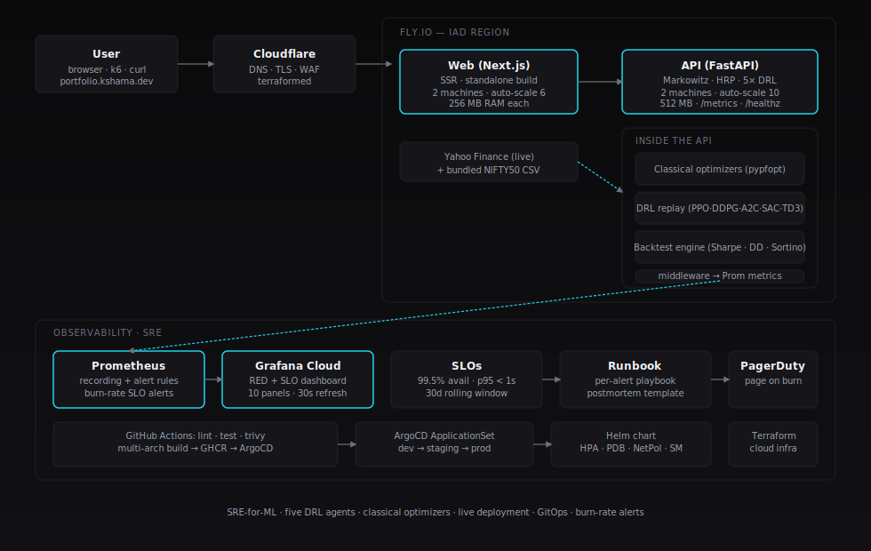

# Architecture

## High level

A two-tier service: a Next.js dashboard talks to a FastAPI inference
backend. The backend serves classical (Markowitz, Max Sharpe, Min Vol, HRP)
and Deep RL (PPO, DDPG, A2C, SAC, TD3) portfolio optimization. Live data
flows in from Yahoo Finance with a bundled NIFTY50 CSV as fallback so the
service stays usable when the upstream is down.

That's the *payload*. The interesting part — and the reason this repo exists
— is the production wrapper around that payload.

## Why this design

The naive deployment of the original notebook code would be: dump it in
Streamlit, push to Streamlit Cloud, paste the link on your resume. That
shows you can run a notebook.

This deployment shows you can **operate** an ML service.

| Concern | How it's addressed |
|---|---|
| Cold start, image size | Multi-stage Docker; runtime image is ~200 MB. No torch needed at inference — the DRL agents' trained policies are replayed from CSV. |
| Repeatable deploys | Helm chart with separate `values.dev.yaml` / `values.staging.yaml` / `values.prod.yaml`. ArgoCD ApplicationSet handles all three envs. |
| Safe rollouts | Rolling update with `maxUnavailable: 0`, PDB with `minAvailable: 1`, startup probe, readiness probe, liveness probe. |
| Observability | Prometheus `/metrics` with RED + business metrics. Recording rules. ServiceMonitor. Grafana dashboard committed as JSON. |
| Alerting that pages on real problems | Multi-window multi-burn-rate alerts per the SRE Workbook. Two SLOs: 99.5% availability, 95% < 1s. |
| Security posture | NetworkPolicy, non-root user, read-only root FS, seccomp `RuntimeDefault`, all caps dropped. Trivy scans on every PR and image. |
| Real workflows | Runbook per alert; one full practice post-mortem. |

## Stack

| Layer | Choice | Why |
|---|---|---|
| Inference | Python 3.11 + FastAPI + pyportfolioopt | Mature, fast, type-friendly. |
| Dashboard | Next.js 15 + Tailwind + Recharts | SSR + good cold-start. Tailwind keeps the visual budget tight. |
| Packaging | Multi-stage Docker, ARM64 + AMD64 | Apple Silicon dev + cheap x86 hosting. |
| Orchestration | Kubernetes + Helm | Same primitives as IBM ROKS/OpenShift; portable. |
| GitOps | ArgoCD with ApplicationSet | The same pattern shipped in production at IBM. |
| Cloud | Fly.io for the live demo | Free tier with TLS and metrics; trivial to swap for AWS EKS later. |
| Observability | Prometheus + Grafana Cloud | Cluster-side scrape via ServiceMonitor; long-term storage in Grafana Cloud (free tier). |
| Infra IaC | Terraform (Fly + Cloudflare + Grafana provider) | Single `apply` brings the whole environment up. |
| CI/CD | GitHub Actions | Lint → test → trivy → build → push → deploy. |
| Load testing | k6 | Smoke runs nightly; stress on demand. |

## Request flow

1. Browser hits `portfolio.kshama.dev` → Cloudflare → Fly web app.
2. Browser issues `POST /proxy/api/v1/backtest`.
3. Next.js rewrites it to the FastAPI service URL.
4. API runs the requested strategies in process — classical optimizers
   compute live, DRL strategies replay precomputed weight trajectories.
5. Backtest engine compounds daily returns, computes Sharpe / Sortino /
   max DD / Calmar / win rate.
6. Response goes back as JSON; the dashboard renders equity curve,
   drawdown, weights, KPI strip, and metrics table.

Per-strategy compute time is recorded as `optimize_duration_seconds`
histogram with a `strategy` label, so the Grafana dashboard surfaces
which optimizer is dragging if latency degrades.
